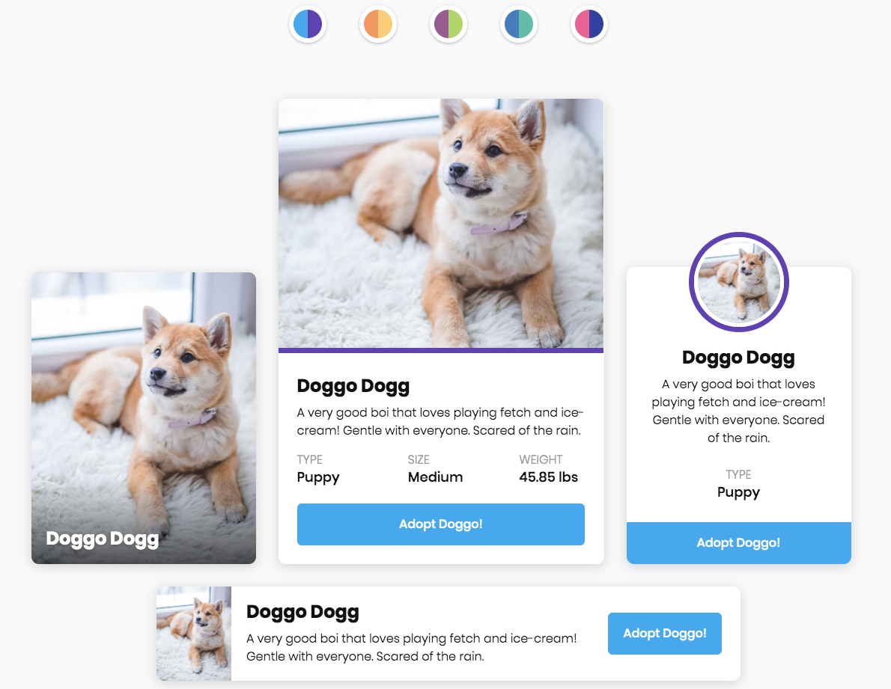
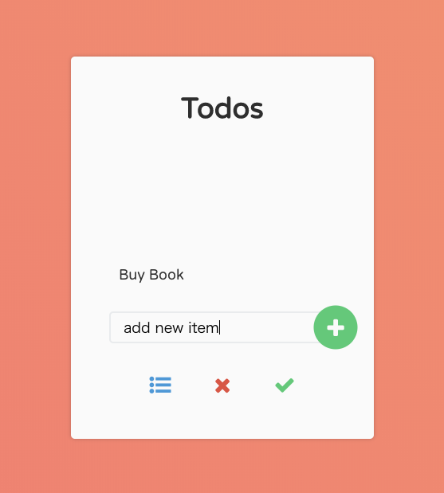

# frontend-framework-handson

## Web フロントエンド開発を体験しよう（React, Vue, Angular） 

このハンズオンでは React, Vue, Angular のいずれかを選択して Web フロントエンドのフレームワークを使用した開発を体験します。

## 実行環境

以下のいずれかを選択してください

- [codesandbox](https://codesandbox.io/)
- [codepen](https://codepen.io/)
- ローカル開発環境

実行環境の用意が面倒な場合は [codesandbox](https://codesandbox.io/)の使用をおすすめします。 
開発環境としては力足らずですが、[codepen](https://codepen.io/)を使用してもよいかもしれません。シンプルに HTML, CSS, JavaScript を書いてプレビューすることができます。 
優れた開発者は手が慣れたキーバインドで動作する軽量なエディタを好むかもしれません。ローカル開発環境を構築してももちろん OK です。

## 作成するアプリケーション

以下のいずれかを選択してください。

### 1. 自己紹介サイト

チームメンバの名前、好きなことなどを表示するサイトを構築してみましょう。

- 必要に応じてコンポーネントの分割を検討してみてください。
- 子コンポーネントに状態を渡すにはどのようにしたら良いでしょうか？

### 2. TODO アプリ

TODO を登録、一覧表示、削除できるシンプルなサイトを構築してみましょう。

- コンポーネント内での状態の管理はどのように実装したら良いでしょうか？
- 必要に応じてコンポーネントの分割を検討してみてください。
- 子コンポーネントに状態を渡すにはどのようにしたら良いでしょうか？

### 3. その他

自由に課題を設定して実装してみましょう。
